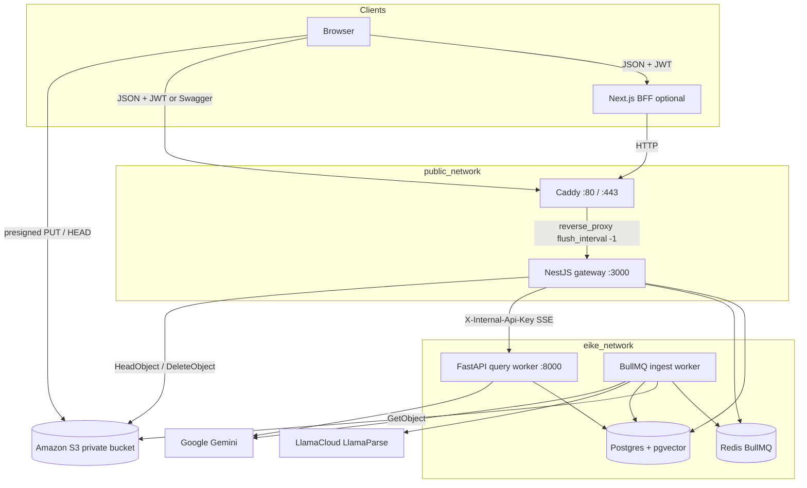
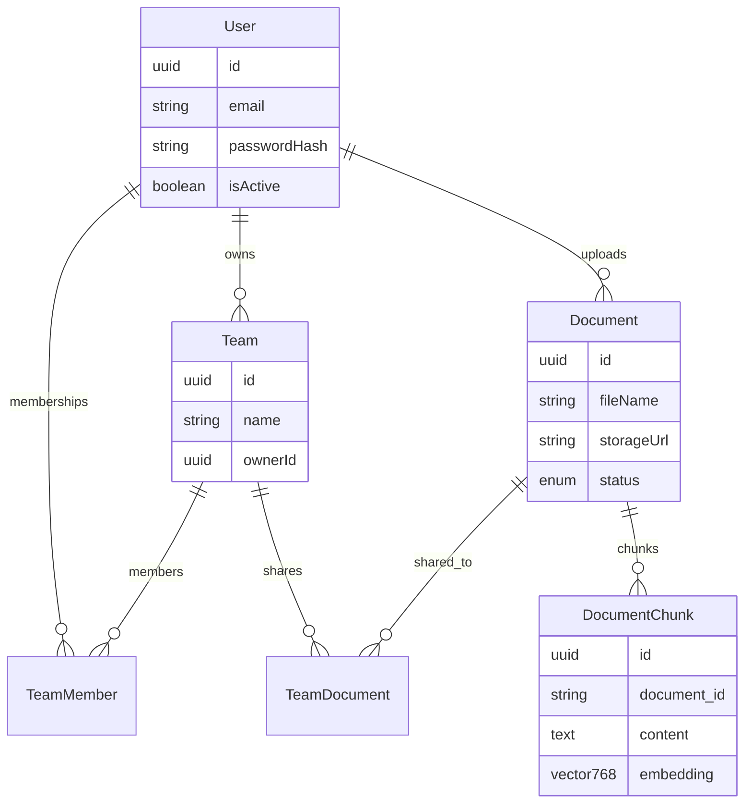
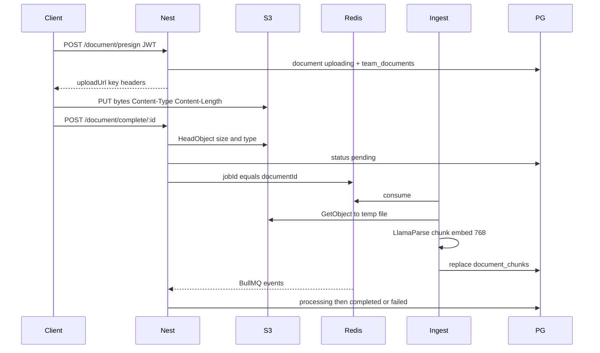
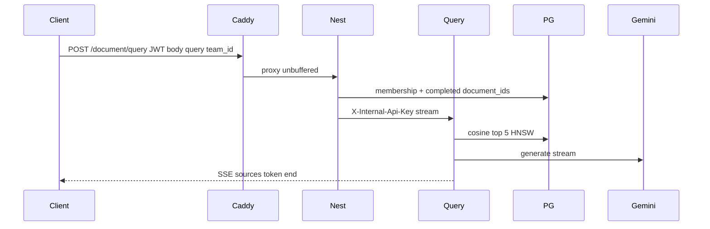

# Enterprise Intelligent Knowledge Engine (EIKE) — backend

EIKE is a team-scoped document Q&A backend. A browser (or the Next.js app) authenticates with JWT, uploads files **directly to S3**, and asks questions. Answers are grounded only in **completed** documents that team can see.

The public HTTP edge is **Caddy**. NestJS is the application gateway (auth, teams, S3 presign, queue, SSE proxy). FastAPI answers questions. A BullMQ ingest worker parses and embeds. Redis is the queue. PostgreSQL + pgvector stores rows and chunk vectors.

The browser never talks to FastAPI, Redis, or Postgres. It never sends `X-Internal-Api-Key`. File bytes never pass through Nest.

## Contents

- [System design](#system-design)
- [Architecture](#architecture)
- [Trust boundaries](#trust-boundaries)
- [Data model](#data-model)
- [Core flows](#core-flows)
- [What is implemented](#what-is-implemented)
- [Tech stack](#tech-stack)
- [Repository layout](#repository-layout)
- [Prerequisites](#prerequisites)
- [Environment](#environment)
- [Run](#run)
- [Schema migrations](#schema-migrations)
- [Typical API flow](#typical-api-flow)
- [API summary](#api-summary)
- [Tests](#tests)
- [Production notes](#production-notes)

## System design

Goals:

- One public door for HTTP (Caddy → Nest). Workers and data stores stay on a private Docker network.
- Nest is a BFF / API gateway: JWT, membership, which `document_ids` a team may search. It is **not** a generic reverse proxy and does **not** parse PDFs.
- Uploads are presigned S3 PUTs so Nest does not buffer 10MB files.
- Ingest is asynchronous (BullMQ). Search only uses `completed` documents.
- RAG is **team-scoped**. The worker never receives a user JWT; Nest injects the allowed document IDs.
- A document always belongs to at least one team. The last share, team delete, leave, or remove-member moves the file to the **owner’s Private** team.
- Embedding dimensionality is **768** (column, Gemini `output_dimensionality`, and HNSW cosine index must match).



Caddy (`caddy/Caddyfile`) listens on host **80** (local: `auto_https off`). Nest has **no host port**. FastAPI, Redis, and Postgres are not published.

## Architecture

```
Browser / Next.js
        |
        | POST /api/v1/document/presign   →  Nest returns S3 PUT URL
        | PUT object bytes                →  S3 (direct)
        | POST /api/v1/document/complete  →  Nest HeadObject + enqueue
        |
        | only public ports :80 and :443
        v
+---------------------------+     public_network
| Caddy                     |
| TLS (prod) / HTTP (local) |
| SSE: flush_interval -1    |
+---------------------------+
        |
        | reverse_proxy gateway-service:3000
        v
+---------------------------+     public_network + eike_network
| Gateway (NestJS)          |
| Auth, users, teams,       |
| presign/complete, SSE     |
| BullMQ producer + observer|
+---------------------------+
        |
        | eike_network (not published)
        +-- Redis 7
        |     queue: document-processing-queue
        +-- Postgres 16 + pgvector
        |     TypeORM: users, teams, team_members,
        |              team_documents, documents
        |     SQLAlchemy: document_chunks
        +-- AI query worker (FastAPI :8000)
        |     embed query → HNSW cosine top 5 → Gemini SSE
        +-- AI ingest worker (same image, other command)
              S3 GetObject, LlamaParse, chunk, embed
              outbound HTTPS to S3 / LlamaCloud / Google
```

Service DNS inside Compose: `postgres_db`, `redis_cache`, `ai-worker`, `gateway-service`.

`eike_network` is a normal bridge (**not** `internal: true`) so Python can still call Gemini, LlamaParse, and S3.

## Trust boundaries

| Surface | Who may call | Auth |
| --- | --- | --- |
| Caddy `:80`/`:443` | Browser, Next server, Swagger | TLS in production |
| Nest `/api/v1/*` | Same, via Caddy | JWT except register/login (`@Public()`) |
| FastAPI `/api/v1/ai/*` | Nest only, on `eike_network` | `X-Internal-Api-Key` (`API_KEY`) |
| Redis / Postgres | Nest + workers | Not published to the host |
| S3 | Browser (presigned PUT), Nest (sign/head/delete), ingest (get) | Bucket private; CORS for the **browser origin** |

Nest `enableCors` is the API origin policy (`GATEWAY_SERVICE_CORS_ORIGIN`). S3 CORS is on the **bucket** (`PUT`, `HEAD`, `Content-Type`). They are not the same setting.

If the Next app proxies `/api/v1` from its own origin, the browser may never hit Caddy directly. Swagger and any client that calls the gateway origin still need Nest CORS.

## Data model



- Register always creates a team named **`Private`** (owner + membership). That name is reserved: no second Private, no rename, delete, reown, or extra members.
- `documents.storageUrl` is an **S3 object key** (`users/{userId}/documents/{documentId}/{fileName}`), not a public URL. It is excluded from JSON.
- `document_chunks` has no FK to TypeORM `documents` (two ORMs, one database). Nest deletes vectors over HTTP when a file or account is removed.
- Status: `uploading` → `pending` → `processing` → `completed` | `failed`.

## Core flows

### Upload and ingest



Job options: `jobId` = document UUID (ingest rejects a mismatch), 3 attempts, exponential backoff 5s, lock 300s, ingest concurrency 1. Chunks: size 1000, overlap 150, embed batches of 50. Retry deletes previous vectors for that `document_id` then inserts.

### Search (SSE)



Use `fetch` (POST + JWT + JSON). `EventSource` cannot do that. Nest skips the 15s timeout on this path. Caddy sets `flush_interval -1`. Nest and FastAPI send `X-Accel-Buffering: no`.

SSE events: `sources`, `token`, `end`.

## What is implemented

**Caddy**

- Reverse proxy to `gateway-service:3000`
- Local Caddyfile: HTTP `:80`, `auto_https off`, gzip, SSE flush
- Host ports 80 and 443 only

**Gateway (NestJS)**

- Register / login, JWT (`passport-jwt`, bcrypt, 24h). Inactive users cannot log in
- Global `JwtAuthGuard`; `@Public()` on register and login only
- Helmet, CORS, 10MB JSON limits, `ValidationPipe` (whitelist + forbid unknown fields)
- Profile `GET /user/me`, `PUT /user/`
- Account delete `DELETE /user/` — blocked if the user owns any team besides Private. Then Private + document rows + user; queue jobs, S3, worker chunks are best-effort after commit
- Teams: list, create, rename (owner), delete (owner), add/remove member by email, change owner (must already be an active member), **leave** (not the owner)
- Last remaining share of a file always lands on the **file owner’s** Private team
- Documents: presign → S3 PUT → complete (`HeadObject`, PDF or text, 1 byte–10MB) → enqueue
- List `/document/list/me` (deduped across teams) and `/document/list/team/:team_id`
- Share / unshare (owner; not Private). Last unshare → owner Private
- Retry failed ingest; delete (owner; `uploading` | `completed` | `failed`)
- Queue listener maps BullMQ `active` / `completed` / `failed` (failed only after attempts are exhausted)
- `POST /document/query` SSE proxy
- Swagger at `/api/v1/docs` (via Caddy: `http://localhost/api/v1/docs`)

**Query worker (FastAPI)**

- Prefix `/api/v1/ai`. Every route including `/health` requires `X-Internal-Api-Key`
- Trusted hosts: `AI_WORKER_ALLOWED_HOSTS` (must include `gateway-service` in Compose)
- Query: Gemini `RETRIEVAL_QUERY` → cosine distance top 5 filtered by `document_ids` → Gemini generate
- Worker rate limit 60/minute on query and chunk delete (in-process; not a substitute for edge limits)
- No HTTP `/process`

**Ingest worker**

- Same image as the query worker; command `python ingest_Document_Queue_Worker.py`
- Payload `{ documentId, bucket, key }`; key must start with `users/`
- LlamaParse markdown → split → `RETRIEVAL_DOCUMENT` embeddings

**Schema**

- Nest `synchronize: false`. TypeORM migrations own gateway tables (`src/migrations/`)
- Worker `python -m core.init_vector_db` on query-container start: `vector` extension, `document_chunks`, HNSW `vector_cosine_ops`

## Tech stack

| Layer | Choices |
| --- | --- |
| Edge | Caddy 2 |
| Gateway | NestJS 12 (ESM), TypeScript, TypeORM, Passport JWT, bcrypt, AWS SDK v3 |
| Query / ingest | FastAPI, Pydantic, SQLAlchemy 2, slowapi, boto3, BullMQ Python |
| Python deps | uv (`uv.lock`) |
| Queue | Redis 7 + BullMQ |
| Database | PostgreSQL 16 + pgvector |
| Object storage | Amazon S3 (presigned PUT); `S3_ENDPOINT` for MinIO |
| Parsing / chunking | LlamaParse, langchain-text-splitters |
| Embed / generate | Google Gemini (`google-genai`) |
| Docs | Swagger on the gateway only |

## Repository layout

```
Enterprise-Intelligent-Knowledge-Engine-EIKE-/
├── .env.example
├── .env                          # secrets (gitignored)
├── docker-compose.yaml
├── caddy/
│   └── Caddyfile                 # local HTTP reverse proxy
├── gateway-service/
│   ├── Dockerfile
│   └── src/
│       ├── main.ts
│       ├── app.module.ts
│       ├── config/env.config.ts
│       ├── database/data-source.ts
│       ├── migrations/
│       └── modules/
│           ├── auth/
│           ├── user/
│           ├── team/
│           └── document/
└── ai-worker/
    ├── Dockerfile
    ├── pyproject.toml
    ├── uv.lock
    ├── main.py
    ├── ingest_Document_Queue_Worker.py
    ├── tests/
    └── core/
        ├── database.py
        ├── document_Chunk_Model.py
        ├── embedding_Service.py
        ├── generative_Service.py
        ├── pdf_Parser_Service.py
        ├── text_Spilliter_Service.py
        └── init_vector_db.py
```

A Next.js UI may live in `web/` (or a separate repo). It should call Caddy (`GATEWAY_SERVICE_URL=http://localhost`), not Nest’s internal port 3000.

## Prerequisites

- Docker Desktop
- Private S3 bucket (Block Public Access; CORS for the **browser** origin, e.g. `http://localhost:3000` if Next runs there)
- [LlamaCloud](https://cloud.llamaindex.ai/) API key
- [Google AI Studio](https://aistudio.google.com/) Gemini keys
- Node.js 20+ and Python 3.10+ with [uv](https://docs.astral.sh/uv/) only for host-side tests or migrations

On Windows, port 80 may require running Docker Desktop with permission to bind privileged ports, or stopping whatever already uses 80.

## Environment

```bash
cp .env.example .env
```

| Variable | Used by |
| --- | --- |
| `POSTGRES_*` / `DATABASE_URL` | Nest, workers, TypeORM CLI |
| `REDIS_HOST` / `REDIS_PORT` | Nest producer, ingest consumer |
| `API_KEY` | Nest → FastAPI header; worker healthcheck |
| `JWT_SECRET` | ≥ 32 characters |
| `GATEWAY_SERVICE_CORS_ORIGIN` | Nest CORS (frontend origin in production) |
| `DOCUMENT_SERVICE_URL` | Nest prefix for `/query` and `/chunks/document/:id` |
| `AI_WORKER_ALLOWED_HOSTS` | FastAPI `TrustedHostMiddleware` |
| `GEMINI_CONTENT_EMBEDDING_API_KEY` | Ingest embeddings |
| `GEMINI_QUERY_EMBEDDING_API_KEY` | Query embeddings (falls back to ingest key) |
| `GEMINI_EMBEDDING_MODEL` | e.g. `gemini-embedding-001` |
| `GEMINI_CONTENT_GENERATE_API_KEY` | Answer generation |
| `GEMINI_GENERATIVE_MODEL` | e.g. `gemini-2.5-flash` |
| `LLAMA_PARSE_API_KEY` | Ingest parse |
| `S3_BUCKET` / `S3_REGION` | Nest + ingest |
| `S3_ACCESS_KEY_ID` / `S3_SECRET_ACCESS_KEY` | Nest Put/Head/Delete; ingest Get |
| `S3_ENDPOINT` | Empty for AWS; MinIO URL only if you use MinIO |

Do not commit `.env`. Do not put S3 keys in a browser app.

Hostnames in `.env` may be `localhost` for laptop tools. Compose **overrides** in-network values:

| Variable | In `.env` (host tools) | Inside Compose |
| --- | --- | --- |
| `POSTGRES_HOST` | `localhost` | `postgres_db` |
| `REDIS_HOST` | `localhost` | `redis_cache` |
| `DATABASE_URL` | `...@localhost:5432/...` | `...@postgres_db:5432/...` |
| `DOCUMENT_SERVICE_URL` | `http://localhost:8000/api/v1/ai` | `http://ai-worker:8000/api/v1/ai` |

Postgres, Redis, Nest, and FastAPI are **not** published to the host in the current Compose file. Host-side Nest/Python against this stack needs extra `ports:` or `docker compose exec`.

Joi requires Postgres/Redis, `DOCUMENT_SERVICE_URL`, `API_KEY`, `JWT_SECRET`, and S3 keys (S3 values may be empty strings; presign then fails at runtime).

## Run

```bash
docker compose up --build
```

Then apply gateway migrations once (empty volume):

```bash
docker compose exec gateway-service npm run migration:run:dist
```

Public URLs (Caddy):

- API: [http://localhost/api/v1](http://localhost/api/v1)
- Swagger: [http://localhost/api/v1/docs](http://localhost/api/v1/docs)

`http://localhost:3000` is **not** the gateway (that port is the Next app if you run it). The query worker is not on the host. That is intentional.

**Smoke check** (private hop from Nest to FastAPI):

```powershell
docker compose exec gateway-service node -e "fetch('http://ai-worker:8000/api/v1/ai/health',{headers:{'X-Internal-Api-Key':process.env.API_KEY}}).then(r=>r.text()).then(console.log)"
```

## Schema migrations

Gateway tables are not auto-created.

```bash
cd gateway-service
# against a reachable Postgres (Compose exec, or published port + .env localhost)
npm run migration:show
npm run migration:run
npm run migration:generate -- src/migrations/Name
```

In the production image use `migration:run:dist`. Vector schema is created by the query worker on start, not by TypeORM.

## Typical API flow

1. `POST /api/v1/auth/register` then `POST /api/v1/auth/login` — also creates Private
2. Authorize in Swagger (JWT, no `Bearer ` prefix in the Swagger box)
3. `POST /api/v1/team`; `POST /api/v1/team/:id/add-member` with `{ "email" }`
4. `POST /api/v1/document/presign` `{ "team_id", "fileName", "contentType", "contentLength" }`
5. `PUT` to `uploadUrl` with the same `Content-Type` and byte length
6. `POST /api/v1/document/complete/:id`
7. Wait until status is `completed` (or `failed` → `POST /document/retry/:id`)
8. `GET /api/v1/document/list/team/:team_id` or `/document/list/me`
9. `POST /api/v1/document/share/:id` / `unshare/:id` with `{ "team_ids": [...] }`
10. `POST /api/v1/document/query` `{ "query", "team_id" }`
11. `POST /api/v1/team/:id/leave` if you are not the owner
12. `DELETE /api/v1/user/` when you own no extra teams

Query example (through Caddy):

```ts
const res = await fetch('http://localhost/api/v1/document/query', {
  method: 'POST',
  headers: {
    Authorization: `Bearer ${token}`,
    'Content-Type': 'application/json',
    Accept: 'text/event-stream',
  },
  body: JSON.stringify({ query: 'What is the work experience?', team_id }),
});
```

## API summary

All gateway routes except register and login require JWT. Worker routes are internal.

| Service | Method | Path | Auth | Notes |
| --- | --- | --- | --- | --- |
| Gateway | POST | `/api/v1/auth/register` | Public | User + Private team |
| Gateway | POST | `/api/v1/auth/login` | Public | `{ accessToken }` |
| Gateway | GET | `/api/v1/user/me` | JWT | `passwordHash` excluded |
| Gateway | PUT | `/api/v1/user/` | JWT | Name / email |
| Gateway | DELETE | `/api/v1/user/` | JWT | Account deletion |
| Gateway | GET | `/api/v1/team/user` | JWT | Memberships + members |
| Gateway | POST | `/api/v1/team` | JWT | Caller is owner |
| Gateway | PATCH | `/api/v1/team/:id` | JWT | Rename (owner; not Private) |
| Gateway | DELETE | `/api/v1/team/:id` | JWT | Owner; not Private; orphans → Private |
| Gateway | POST | `/api/v1/team/:id/add-member` | JWT | Owner; `{ email }` |
| Gateway | POST | `/api/v1/team/:id/remove-member` | JWT | Owner; cannot remove self |
| Gateway | POST | `/api/v1/team/:id/change-owner` | JWT | Owner; `{ email }`; must be a member |
| Gateway | POST | `/api/v1/team/:id/leave` | JWT | Not the owner; last-share files → Private |
| Gateway | POST | `/api/v1/document/presign` | JWT | S3 PUT URL; status `uploading` |
| Gateway | POST | `/api/v1/document/complete/:id` | JWT | HeadObject + enqueue |
| Gateway | GET | `/api/v1/document/list/me` | JWT | Deduped across teams |
| Gateway | GET | `/api/v1/document/list/team/:team_id` | JWT | Must be a member |
| Gateway | POST | `/api/v1/document/share/:id` | JWT | Owner; `{ team_ids }` |
| Gateway | POST | `/api/v1/document/unshare/:id` | JWT | Last share → Private |
| Gateway | POST | `/api/v1/document/query` | JWT | SSE; `{ query, team_id }` |
| Gateway | POST | `/api/v1/document/retry/:id` | JWT | Failed only |
| Gateway | DELETE | `/api/v1/document/delete/:id` | JWT | Owner; row + chunks + S3 |
| Query worker | GET | `/api/v1/ai/health` | API key | Internal |
| Query worker | POST | `/api/v1/ai/query` | API key | Vector search + SSE |
| Query worker | DELETE | `/api/v1/ai/chunks/document/:id` | API key | Drop vectors |

## Tests

```bash
cd gateway-service && npm test
cd gateway-service && npm run test:e2e
```

```bash
cd ai-worker
uv sync --frozen --group dev
uv run pytest
```

Gateway: Vitest. Worker: pytest (API key, job validation, query helpers). Tests do not call Gemini or LlamaParse.

## Production notes

- Publish **Caddy 80/443 only**. Do not map Nest 3000, FastAPI 8000, Postgres, or Redis.
- Put request rate limits on Caddy (or Cloudflare), not inside Nest. Login/register should be stricter than the rest of the API.
- Production Caddyfile: a real hostname, Let’s Encrypt, keep `flush_interval -1` and long timeouts on `/api/v1/document/query`. Do not gzip that stream.
- Set `GATEWAY_SERVICE_CORS_ORIGIN` to the frontend origin. Update S3 bucket CORS to the same browser origin.
- Run TypeORM migrations before traffic. Keep embedding size **768**.
- Compose memory: Postgres 2G, ingest 2G, query 1.5G, Nest 1G, Redis 256M, Caddy 128M. A 1 GB VM will OOM.
- A 24/7 host is required (VPS or a machine that stays on). Typical $0 PaaS (Vercel, tiny free VMs) cannot run this Compose file. Next.js can sit on Vercel; this backend cannot.

## Notes

- Search is scoped by **team**: Nest sends completed `document_ids` for that team.
- Redis is the BullMQ broker only. Query cache is not implemented.
- Do not set `internal: true` on `eike_network`.
